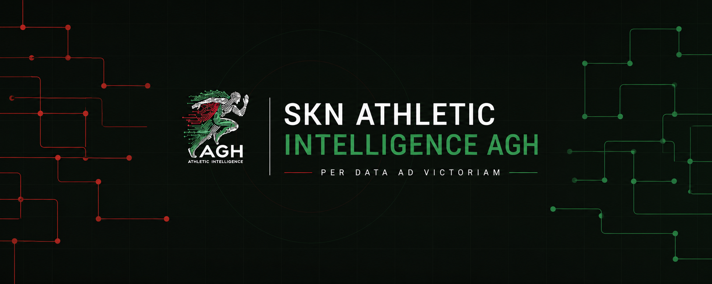

**Artificial Intelligence · Machine Learning · Data Science · Computer Vision · Sports Analytics · Software Development**

A student research group at AGH University of Krakow developing data-driven technologies for sport.

---

## About us

**SKN Athletic Intelligence AGH** is a student research group connecting technology, data and sport.

We bring together students interested in artificial intelligence, machine learning, computer vision, data science, software engineering and sports analytics. Our goal is to create practical solutions that support better understanding of performance, behaviour and decision-making in sport.

---

## Our areas

| Area                         | What we work on                                                                     |
| ---------------------------- | ----------------------------------------------------------------------------------- |
| 🤖 **AI & Machine Learning** | Predictive modelling, recommendation systems and intelligent decision-support tools |
| 👁️ **Computer Vision**      | Player detection, tracking, video analysis and automatic event recognition          |
| 📊 **Data Science & BI**     | Data exploration, dashboards, reporting and interactive visualisations              |
| 🏃 **Performance Analytics** | Match, tracking, physical and biometric data analysis                               |
| 🧠 **Behavioural Analytics** | Fan behaviour, engagement, communication and decision-making analysis, Business intelligence               |
---

## Our projects

### AXIA

An intelligent football analysis ecosystem developed to support analysts and coaching staff.

The project combines match data, computer vision and machine learning to automate selected elements of match analysis. Its development includes player and ball tracking, tactical analysis, event recognition, performance indicators and recommendation mechanisms.

### Kinesis

A project focused on the analysis of physical performance and movement in sport.

We explore tracking, biometric and training data to better understand workload, sprinting, high-intensity activity, changes of direction, movement profiles and injury-related risk factors.

### Business & Behavioural Intelligence

We are expanding our activity beyond performance analysis into the business side of sport
---

## How we work

Our members work in interdisciplinary project teams covering:

* data acquisition and engineering,
* exploratory and statistical analysis,
* machine learning and deep learning,
* computer vision,
* dashboards and applications,
* research, documentation and presentation of results.

We aim to develop complete solutions — from defining the problem and preparing data to model evaluation, visualisation and deployment.

---

## Technology

---

## Join us

We welcome AGH students interested in technology, data, sport and business.

You do not need to be an expert. We value curiosity, commitment and willingness to learn through real projects.

---

## Collaboration

We are open to cooperation with sports clubs, companies, research institutions, data providers and other student organisations.

### Connect with us

[Website](https://aisports.pl) ·
[LinkedIn](https://www.linkedin.com/company/agh-athletic-intelligence/) ·
[Facebook](https://www.facebook.com/profile.php?id=61575430083885) ·
[Instagram](https://www.instagram.com/atheltic_agh/) ·
[X](https://x.com/agh_athletic) ·
[Email](mailto:athletic@agh.edu.pl)

 

**SKN Athletic Intelligence AGH**
*Per data ad victoriam.*

